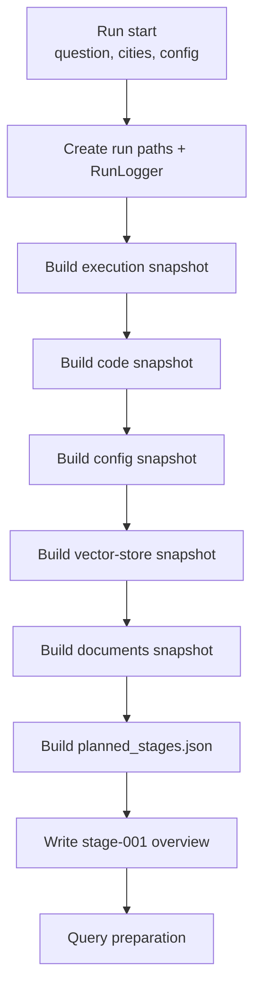

# Input Snapshot

The input snapshot stage (`001_input_snapshot`) captures everything needed to reproduce and audit a run before retrieval starts. It establishes the run folder, initializes `context_bundle.json` and `api_state.json`, and freezes invocation, code, config, document, and vector-store state.

## What It Does

- Resolves the final run id and creates the run directory layout under `output/<run_id>/`.
- Initializes the live `context_bundle.json` with the research question and run metadata.
- Writes reproducibility snapshots for execution, git/code state, resolved config, vector-store manifest, and selected Markdown documents.
- Persists `planned_stages.json`, the contract that tells the API and UI which pipeline stages are enabled for this run.

## Detailed Logic

## Decisions

- **Run id resolution:** the requested run id may be adjusted when creating run paths; both requested and resolved ids are stored in `execution_snapshot.json`.
- **City scope:** selected cities are recorded in run inputs and in `documents_snapshot.json`, which hashes only the Markdown files in scope for this run.
- **Planned stages:** when `ENRICHMENT_ENABLED` is false, enrichment, enrichment handoff, assumptions, and assumptions handoff are marked `disabled` in `planned_stages.json` rather than omitted.
- **Vector store:** the snapshot records whether vector retrieval is enabled and hashes the current index manifest so later retrieval behavior can be explained.

## Context Bundle Effect

Input snapshot does not add evidence blocks yet. It seeds run-level metadata that later stages read and extend:

- `research_question` / `original_question`
- `query_mode`
- `analysis_mode`
- `selected_cities` / city scope fields
- empty or placeholder structures for `markdown`, and optionally `enrichment` / `assumptions`

The live `context_bundle.json` at the run root is updated throughout the pipeline; handoff snapshots freeze it at specific checkpoints.

## Key Artifacts

- `stage_files/001_input_snapshot/execution_snapshot.json`
- `stage_files/001_input_snapshot/code_snapshot.json`
- `stage_files/001_input_snapshot/config_snapshot.json`
- `stage_files/001_input_snapshot/vector_store_snapshot.json`
- `stage_files/001_input_snapshot/documents_snapshot.json`
- `stage_files/001_input_snapshot/planned_stages.json`
- `stages/001_input_snapshot.json`
- `context_bundle.json` (run root, initialized here)
- `api_state.json` (run root, initialized here)

## Config

- `llm_config.yaml` path used for the run (hashed in `config_snapshot.json`)
- `MARKDOWN_DIR`
- `VECTOR_STORE_ENABLED` and `vector_store.*` settings
- `ENRICHMENT_ENABLED` (controls planned enrichment/assumptions stages)

## Boundaries And Limitations

- Snapshots describe the run at start time; they do not re-check git or document hashes after the stage completes.
- `code_snapshot.json` depends on git being available in the checkout; non-git environments still run, but commit metadata may be empty.
- Input snapshot is diagnostic, not a security boundary: it records config and file hashes, not secrets.
