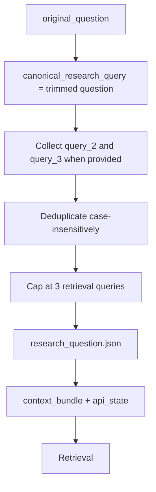

# Query Preparation

Query preparation (`002_query_preparation`) freezes the research question and the retrieval queries that downstream chunk selection will use. It runs immediately after input snapshot and before retrieval.

## What It Does

- Stores the verbatim user question as `original_question`.
- Sets `canonical_research_query` to the trimmed question text (primary retrieval query).
- Builds up to three deduplicated retrieval queries from the question plus optional `query_2` and `query_3` CLI/API inputs.
- Persists `query_mode` (`standard` or `dev`) for diagnostics and API display.
- Writes `research_question.json` and updates both `context_bundle.json` and `api_state.json`.

## Detailed Logic



## Decisions

- **Verbatim queries:** retrieval uses the prepared query strings directly. Query preparation does not rewrite or expand the question with an LLM.
- **Fallback:** if all provided queries are empty after normalization, retrieval falls back to `[canonical_research_query]`.
- **Order preservation:** duplicate queries (case-insensitive) are dropped while keeping the first occurrence.
- **Query mode:** `query_mode` is a persisted label for run inspection. It does not change how queries are built today; optional extra queries come from explicit `query_2` / `query_3` inputs.

## Context Bundle Effect

Query preparation updates top-level run inputs:

```json
{
  "original_question": "…",
  "research_question": "…",
  "canonical_research_query": "…",
  "query_mode": "standard",
  "retrieval_queries": ["…"],
  "retrieval_query_count": 1
}
```

Retrieval and vector search read `retrieval_queries`. The writer later receives `research_question` through the writer-safe context projection.

## Key Artifacts

- `stage_files/002_query_preparation/research_question.json`
- `stages/002_query_preparation.json`
- `context_bundle.json` (updated in place)
- `api_state.json` (updated in place)

## Config And Inputs

- CLI/API: `--query-2`, `--query-3` (optional additional retrieval queries)
- API: `query_mode` (`standard` | `dev`)
- Benchmarks may supply fixed retrieval query overrides per question for stable chunk counts

## Boundaries And Limitations

- Query preparation does not select cities or Markdown files; city scope is decided at run start and recorded during input snapshot.
- Extra retrieval queries improve recall in vector mode but can also increase noise; tune with benchmarks when comparing runs.
- Changing queries after this stage requires a new run; there is no mid-run query rewrite step.
