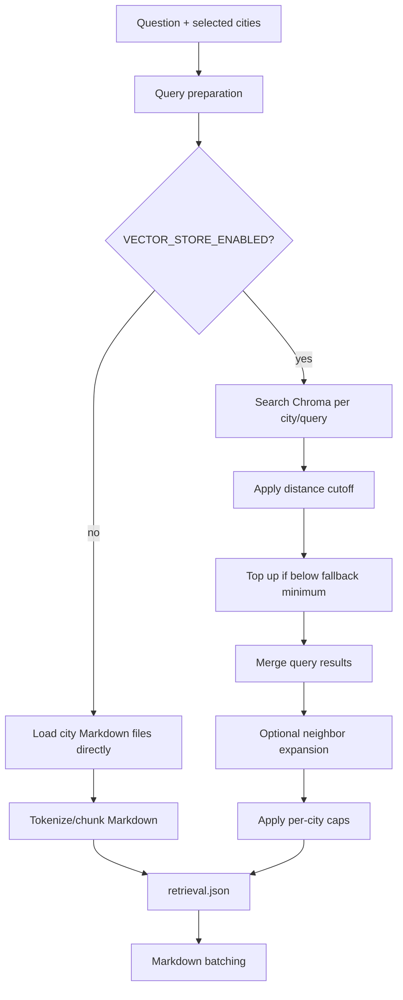

# Retrieval

Retrieval chooses which CCC Markdown chunks should be sent to the markdown researcher. It can run in direct chunking mode or vector-store mode, depending on config.

## What It Does

- Resolves selected city Markdown files from `MARKDOWN_DIR`.
- Uses the original question and optional retrieval queries from query preparation.
- Produces chunk records with text, city, source path, heading path, and provenance.
- Writes a stable retrieval artifact for inspection and benchmarking.

## Detailed Logic

## Decisions

- **City scope:** selected city filters come from the API/CLI run input. If no city filter is provided, the run can consider all top-level city Markdown files.
- **Distance metric:** `vector_store.distance_metric` selects the Chroma HNSW space (`l2`, `cosine`, or `ip`) used by the persisted collection. The current default is `cosine`.
- **Embedding provider:** `vector_store.embedding_base_url` and `vector_store.embedding_api_key_env` configure the OpenAI-compatible embeddings endpoint separately from the chat/LLM provider. When the key env is explicit, only that env var is used.
- **Vector cutoff:** `vector_store.retrieval_max_distance` controls strictness. A low cutoff improves relevance but can drop useful chunks.
- **Fallback top-up:** if too few chunks pass the cutoff, retrieval can add next-best chunks to preserve recall.
- **Neighbor expansion:** vector hits can pull neighboring chunks to restore local document context.

## Context Bundle Effect

Retrieval does not directly add final evidence to `context_bundle.markdown`. It supplies candidate chunks that the markdown researcher must accept or reject.

## Key Artifacts

- `stage_files/003_retrieval/retrieval.json`
- `stages/003_retrieval.json`
- `stage_files/005_markdown_batching/source_chunk_index.json` later maps chunk ids back to source hints.

## Config

- `VECTOR_STORE_ENABLED`
- `MARKDOWN_DIR`
- `vector_store.retrieval_max_chunks_per_city_query`
- `vector_store.distance_metric`
- `vector_store.embedding_base_url`
- `vector_store.embedding_api_key_env`
- `vector_store.retrieval_max_distance`
- `vector_store.retrieval_fallback_min_chunks_per_city_query`
- `vector_store.context_window_chunks`
- `vector_store.table_context_window_chunks`
- `vector_store.retrieval_max_chunks_per_city`

## Boundaries And Limitations

- Retrieval is recall-oriented. It may include chunks that do not become evidence.
- A retrieved chunk is not a citation until the markdown researcher accepts an excerpt.
- Vector retrieval quality depends on the vector-store manifest matching the current `documents/` corpus.
- Metric and embedding-provider changes require a separate persisted index or full rebuild; distance values are not directly comparable across metrics.
- ON-6001 calibration selected `vector_store.retrieval_max_distance: 0.55` as the initial cosine cutoff. See `docs/on-6001-vector-store-querying-analysis.md` for the supporting analysis.
