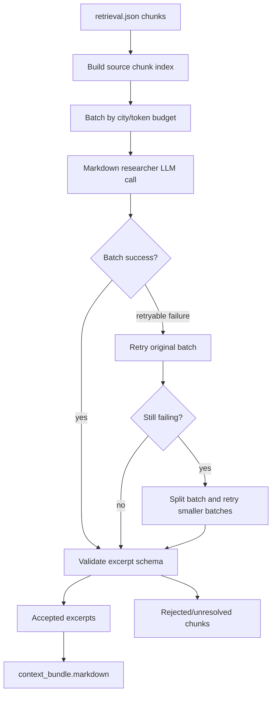

# Markdown Researcher

The markdown researcher reads retrieved CCC chunks and extracts answer-relevant, citeable excerpts. This is the main path from CCC source text into `context_bundle.markdown`.

## What It Does

- Groups retrieval chunks into LLM-sized batches.
- Asks the markdown researcher model to identify relevant evidence.
- Accepts excerpts with quotes, partial answers, city metadata, and source chunk ids.
- Writes rejected/unresolved diagnostics for debugging retrieval and extraction quality.

## Detailed Logic



## Decisions

- **Batch size:** controlled by chunk count and token budget settings.
- **Acceptance:** the markdown researcher must return structured excerpts grounded in chunk text.
- **Retries and splitting:** retryable failures are retried, then recursively split to avoid losing an entire run because one batch is problematic.
- **City purity:** batches are organized to preserve city context and make diagnostics easier.

## Context Bundle Effect

After markdown extraction, the orchestrator writes:

```json
{
  "markdown": {
    "status": "success",
    "excerpts": [
      {
        "ref_id": "ref_1",
        "quote": "...",
        "city_name": "aachen",
        "city_key": "aachen",
        "partial_answer": "...",
        "source_chunk_ids": ["chunk_..."]
      }
    ],
    "excerpt_count": 1
  }
}
```

This block is the writer's primary cited evidence source.

## Key Artifacts

- `stage_files/005_markdown_batching/batches.json`
- `stage_files/005_markdown_batching/source_chunk_index.json`
- `stage_files/006_markdown_extraction/accepted_excerpts.json`
- `stage_files/006_markdown_extraction/rejected_chunks.json`
- `stage_files/006_markdown_extraction/decision_audit.json`
- `stage_files/006_markdown_extraction/city_summary.json`
- `stage_files/007_markdown_context_handoff/context_bundle_after_markdown.json`

## Config

- `markdown_researcher.max_chunk_tokens`
- `markdown_researcher.chunk_overlap_tokens`
- `markdown_researcher.batch_max_chunks`
- `markdown_researcher.batch_max_input_tokens`
- `markdown_researcher.batch_overhead_tokens`
- `markdown_researcher.max_turns`
- shared retry settings in `llm_config.yaml`

## Boundaries And Limitations

- The markdown researcher should only cite CCC Markdown chunks that were retrieved and batched.
- It can miss facts if retrieval did not deliver the right chunk or if a batch extraction fails.
- Rejected chunks are not necessarily bad chunks; they may simply be irrelevant to the user question.
