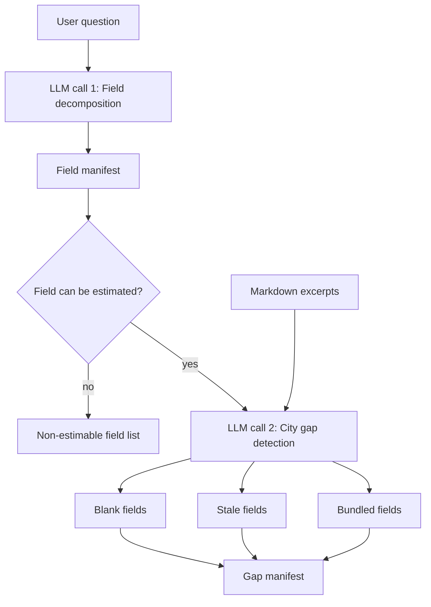

# Gap Analysis

Gap analysis turns the user question and CCC markdown evidence into structured fields that enrichment can search, resolve, or estimate.

## What It Does

- Decomposes the question into field-like data needs.
- Classifies each field as `estimable_numerical`, `derivable_from_ratio`, or `non_estimable`.
- Uses the fixed field list plus markdown excerpts to detect city-field gaps.
- Checks estimable and derivable fields for `blank`, `stale`, or `bundled` status per city.
- Carries non-estimable fields separately instead of adding them to city gaps.
- Produces manifests that downstream external sources, web research, and assumptions use.

## Detailed Logic



In the default split flow, the two LLM calls are the two labeled nodes in the
diagram. `decompose_fields` runs LLM call 1 against only the user question: it
breaks the question into granular fields and assigns one classification per
field. `detect_city_gaps` runs LLM call 2 with those fixed fields plus the
markdown excerpts: it decides which city-field values are missing, stale, or
only available as an aggregate.

The Mermaid labels above are readable names. In the artifact, they map to:

- **Field manifest:** `enrichment.field_manifest`
  - `query_fields`: every decomposed field, with `field`, `classification`, `searchable`, `rationale`, and `scope`.
  - `non_estimable_fields`: field names whose classification is `non_estimable`.
- **Gap manifest:** `enrichment.gap_manifest`
  - `city_gaps`: one entry per city with `blank_fields`, `stale_flags`, `bundled_fields`, and `search_priority`.

## Decisions

- **Estimable numerical:** a concrete numeric quantity such as a cost, count,
  capacity, area, or target. It is suitable for external search and, if still
  unresolved later, may be estimated from peer-city anchors or national/regional
  averages. Example: `public_dc_charger_count`.
- **Derivable from ratio:** a numeric value that is not usually estimated
  directly, but can be calculated from another known quantity plus a peer or
  national ratio. Example: `depot_charger_count` can be derived from fleet size
  using a charger-to-vehicle ratio.
- **Non-estimable:** a field where a numeric proxy would be misleading or where
  the answer is qualitative, legally specific, or strongly local. Example:
  `residential_onstreet_charging` can depend on housing stock, street layout,
  and parking policy; a per-capita proxy would hide the real local constraints.
- **Blank:** the markdown excerpts contain no concrete value for a field that
  should have a value. Example: the question asks for `public_dc_charger_count`
  and the city's CCC excerpts contain no DC charger count.
- **Stale:** the markdown value appears outdated or too weak to trust as a
  current value. The prompt uses the configured freshness threshold and also
  treats aspirational text such as "plans to" or "targets" without concrete
  numbers as stale for gap purposes.
- **Bundled:** the markdown has a parent or aggregate number, but not the exact
  requested line item. Example: the CCC says total fleet CAPEX is EUR 100M, but
  the question asks for per-vehicle CAPEX. The field is not blank, because some
  relevant aggregate exists, but it still needs derivation or external evidence.

## Worked Example

Question:

> What charging infrastructure volume targets by 2030 are in the CCCs: public
> charging points, depot charging, bus charging depots, fast corridors, and
> residential on-street charging?

Field decomposition might produce:

```json
{
  "field_manifest": {
    "query_fields": [
      {
        "field": "public_dc_charger_count",
        "classification": "estimable_numerical",
        "searchable": true,
        "rationale": "A concrete infrastructure count often reported by city plans or registries.",
        "scope": "mixed"
      },
      {
        "field": "depot_charger_count",
        "classification": "derivable_from_ratio",
        "searchable": true,
        "rationale": "Can be derived from fleet size using peer charger-to-vehicle ratios.",
        "scope": "municipal"
      },
      {
        "field": "residential_onstreet_charging",
        "classification": "non_estimable",
        "searchable": false,
        "rationale": "Too dependent on local housing, street, and parking conditions for a safe proxy.",
        "scope": "private"
      }
    ],
    "non_estimable_fields": ["residential_onstreet_charging"]
  }
}
```

City gap detection might then produce:

```json
{
  "gap_manifest": {
    "city_gaps": [
      {
        "city": "Dresden",
        "blank_fields": ["public_dc_charger_count"],
        "stale_flags": [],
        "bundled_fields": ["depot_charger_count"],
        "search_priority": "high"
      }
    ]
  }
}
```

In this example, downstream stages can search or estimate the DC charger count,
derive depot chargers from a related fleet or depot ratio, and carry
residential on-street charging as a non-estimable gap instead of inventing a
number.

## Context Bundle Effect

Gap analysis contributes to:

```json
{
  "enrichment": {
    "field_manifest": {
      "query_fields": [],
      "non_estimable_fields": []
    },
    "gap_manifest": {
      "city_gaps": []
    }
  }
}
```

## Key Artifacts

- `stage_files/008_enrichment/enrichment_bundle.json`
- `stages/008_enrichment.json`

Standalone `field_manifest.json` and `gap_manifest.json` projection files are not written; use the canonical enrichment bundle.

## Config

- `ENRICHMENT_ENABLED`
- enrichment model settings in `llm_config.yaml`
- selected city scope from API/CLI run input

## Boundaries And Limitations

- Gap analysis depends on what markdown extraction surfaced. If the CCC excerpt is missing a relevant fact, gap analysis may classify a field as missing.
- Classification is intentionally coarse. The exact field names are operational handles for enrichment, not a universal ontology.
- Non-estimable classification happens before external/web search; later stages may still find direct evidence for estimable fields.
