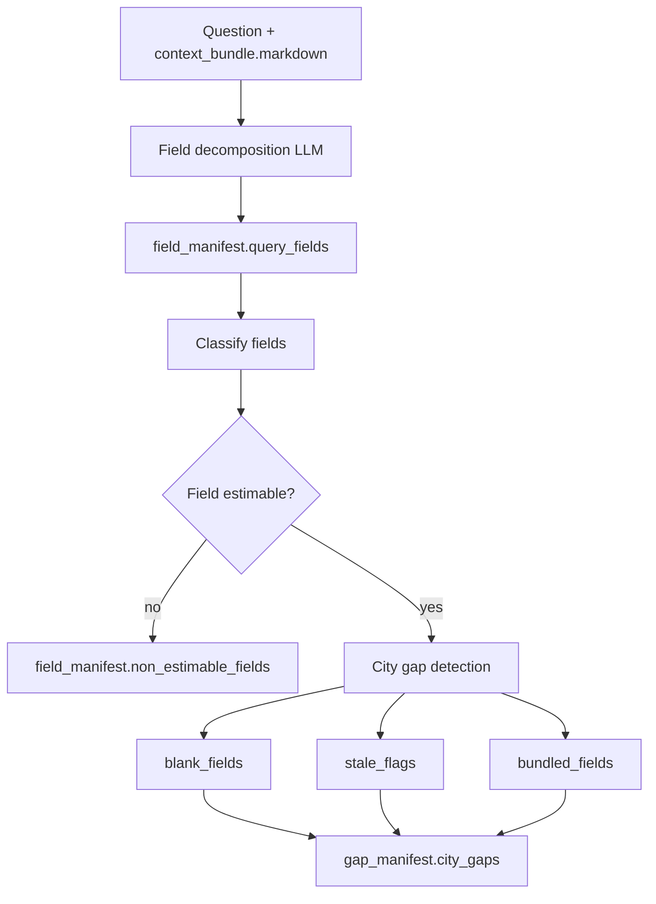

# Gap Analysis

Gap analysis turns the user question and CCC markdown evidence into structured fields that enrichment can search, resolve, or estimate.

## What It Does

- Decomposes the question into field-like data needs.
- Classifies each field as estimable numerical, derivable from ratio, or non-estimable.
- Detects city-field gaps using the markdown excerpts.
- Produces manifests that downstream external sources, web research, and assumptions use.

## Detailed Logic



## Decisions

- **Estimable numerical:** a field can plausibly be estimated from anchors, peer-city data, national averages, or ratios.
- **Derivable from ratio:** a value can be derived from known quantities and a peer/national ratio.
- **Non-estimable:** qualitative, legally specific, or local-policy fields where numeric proxying would be misleading.
- **Blank/stale/bundled:** city gaps distinguish absent values, potentially stale values, and aggregate values that do not match the requested line item.

## Context Bundle Effect

Gap analysis contributes to:

```json
{
  "enrichment": {
    "field_manifest": {
      "query_fields": [],
      "non_estimable_fields": []
    },
    "gap_manifest": {
      "city_gaps": []
    }
  }
}
```

## Key Artifacts

- `stage_files/008_enrichment/enrichment_bundle.json`
- `stages/008_enrichment.json`

Standalone `field_manifest.json` and `gap_manifest.json` projection files are not written; use the canonical enrichment bundle.

## Config

- `ENRICHMENT_ENABLED`
- enrichment model settings in `llm_config.yaml`
- selected city scope from API/CLI run input

## Boundaries And Limitations

- Gap analysis depends on what markdown extraction surfaced. If the CCC excerpt is missing a relevant fact, gap analysis may classify a field as missing.
- Classification is intentionally coarse. The exact field names are operational handles for enrichment, not a universal ontology.
- Non-estimable classification happens before external/web search; later stages may still find direct evidence for estimable fields.
