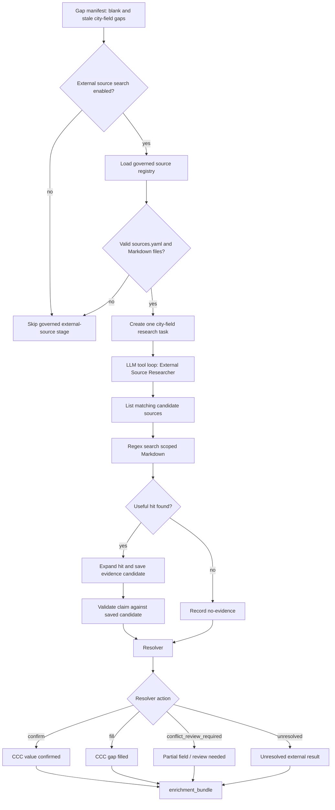

# External Sources

External-source search is the governed enrichment path over curated Markdown sources outside the CCC corpus. It is meant to be more auditable than open web search.

## What It Does

- Loads governed source metadata from `documents/source_library/sources.yaml`.
- Builds one research task for each blank or stale city-field gap from the gap manifest.
- Runs an external-source researcher LLM with controlled tools over scoped Markdown.
- Selects candidate sources by metadata, then searches and expands line-backed hits.
- Produces validated evidence claims, no-evidence records, and resolver decisions.
- Writes an audit artifact when the stage runs.

This is not open web search. If this stage is skipped, the later
[Web Research](08_web-research.md) stage can still run if it is enabled and
there are city gaps.

## Input From Gap Analysis

External-source search does not invent new fields. It starts from the fields
created by gap analysis:

- `field_manifest.query_fields`: the full field list decomposed from the user
  question.
- `gap_manifest.city_gaps`: the per-city subset where the CCC excerpts did not
  fully answer the field.

A **city-field gap** means one field for one city still needs help. For example,
`public_dc_charger_count` may be answered for Dresden but blank for Krakow, so
only `Krakow / public_dc_charger_count` becomes a searched city-field gap.

This stage currently creates research tasks only from `blank_fields` and
`stale_flags`. Bundled-only gaps are not sent to this stage today; they stay for
later derivation or assumptions handling.

## Detailed Logic



The LLM does not browse the web. It can only call the external-source tools:
`get_tag_options`, `list_candidate_sources`, `regex_search`, `expand_hits`,
`add_evidence_candidates`, `list_evidence_candidates`, and
`mark_no_evidence_found`.

If the main tool loop runs out of turns or leaves promising hits unfinished, a
smaller finalizer LLM may inspect already saved candidates. The finalizer cannot
search; it only turns saved candidates into claims or rejects them.

## Decisions

- **Candidate source selection:** source matching is metadata-first. The registry
  loads `sources.yaml`, validates that each `source_id` maps to one Markdown
  file, and exposes available tags. Candidate filters can include city, country,
  vertical, TEF sector, source type, and publication year. Filters are OR within
  one category and AND across categories; direct city/country matches and newer
  sources are ranked first.
- **Scoped search:** regex search must be scoped by metadata filters or by a
  prior candidate-source list. This prevents the LLM from searching the whole
  source library accidentally.
- **Evidence candidate:** a saved, line-backed quote from a searched Markdown
  file. Final claims are accepted only if they reference a saved candidate for
  the same city-field task.
- **Resolver action:** the resolver uses four canonical action names:
  `confirm`, `fill`, `conflict_review_required`, and `unresolved`.
  - `confirm` means the field was searched because CCC evidence was stale or
    needed checking, and external evidence supports the CCC value.
  - `fill` means CCC evidence was blank and external evidence supplies a usable value.
  - `conflict_review_required` means external evidence appears to challenge stale
    or partial CCC evidence and should be reviewed.
  - `unresolved` means governed sources were searched but did not produce usable evidence.
    Raw evidence claims also carry `claim_role` values such as `fills_missing`,
    but downstream status decisions should read the resolver `action`.
- **No evidence:** records that governed sources were searched but did not
  contain a usable answer for the city-field.
- **Skipped governed search:** means only this curated Markdown stage did not
  run, usually because it was disabled, there were no city gaps, or the source
  registry was missing/invalid. It does not mean open web research is skipped.

## Example Output

One external-source pass may add a resolved claim and one no-evidence record:

```json
{
  "external_evidence": [
    {
      "city": "Krakow",
      "field": "secap_local_co2_reduction_2030_target",
      "value": 30,
      "unit": "%",
      "source_id": "krakow-target",
      "source_type": "city_cap",
      "publication_year": 2025,
      "line_start": 2,
      "line_end": 3,
      "quote": "Krakow sets a local CO2 reduction target of 30% by 2030.",
      "confidence": 0.9,
      "claim_role": "fills_missing",
      "candidate_id": "e1"
    }
  ],
  "external_resolutions": [
    {
      "city": "Krakow",
      "field": "secap_local_co2_reduction_2030_target",
      "action": "fill",
      "external_value": 30,
      "unit": "%",
      "source_id": "krakow-target",
      "line_start": 2,
      "line_end": 3,
      "quote": "Krakow sets a local CO2 reduction target of 30% by 2030.",
      "confidence": 0.9,
      "rationale": "CCC evidence is missing, and tagged external evidence fills the gap."
    },
    {
      "city": "Krakow",
      "field": "public_dc_charger_count",
      "action": "unresolved",
      "rationale": "Tagged external sources were searched, but no usable evidence was found for this city-field gap."
    }
  ],
  "external_no_evidence": [
    {
      "record_id": "n1",
      "city": "Krakow",
      "field": "public_dc_charger_count",
      "searched_source_ids": ["krakow-target"],
      "search_summary": "No usable value found in the searched governed sources."
    }
  ]
}
```

Here, `field` is the same gap-analysis field name, not a generic placeholder.
`record_id` values such as `n1` are run-local audit IDs generated for
no-evidence records.

## Context Bundle Effect

External sources populate:

```json
{
  "enrichment": {
    "external_evidence": [],
    "external_resolutions": [],
    "external_no_evidence": [],
    "enriched_fields": []
  }
}
```

Resolved external decisions can update `enriched_fields` before assumptions run.

## Key Artifacts

- `stage_files/008_enrichment/external_source_search_audit.json`
- `stage_files/008_enrichment/enrichment_bundle.json`
- `stages/008_enrichment.json`

The audit artifact includes searched city-fields, saved candidates, validated
claims, rejected claims, no-evidence records, resolver decisions, and controlled
tool-call logs.

## Config

- `EXTERNAL_SOURCE_SEARCH_ENABLED`
- `EXTERNAL_SOURCE_DIR`
- governed source metadata under `documents/source_library/sources.yaml`
- external-source model/tool settings in `llm_config.yaml`
- tool caps such as maximum source files, regex searches, matches, expanded
  hits, snippet size, and pattern length

## Boundaries And Limitations

- This stage searches curated Markdown only; it is not open web search.
- The stage does not handle bundled-only gaps today; it builds tasks from blank
  and stale fields.
- If the registry is missing or invalid, governed external-source search returns
  no claims and the wider enrichment pipeline continues.
- If the registry is valid but no source matches a city-field task, the agent can
  record a no-evidence result instead of producing a claim.
- A candidate is not accepted evidence until the resolver validates it.
- The current benchmark coverage is useful but still narrow.
