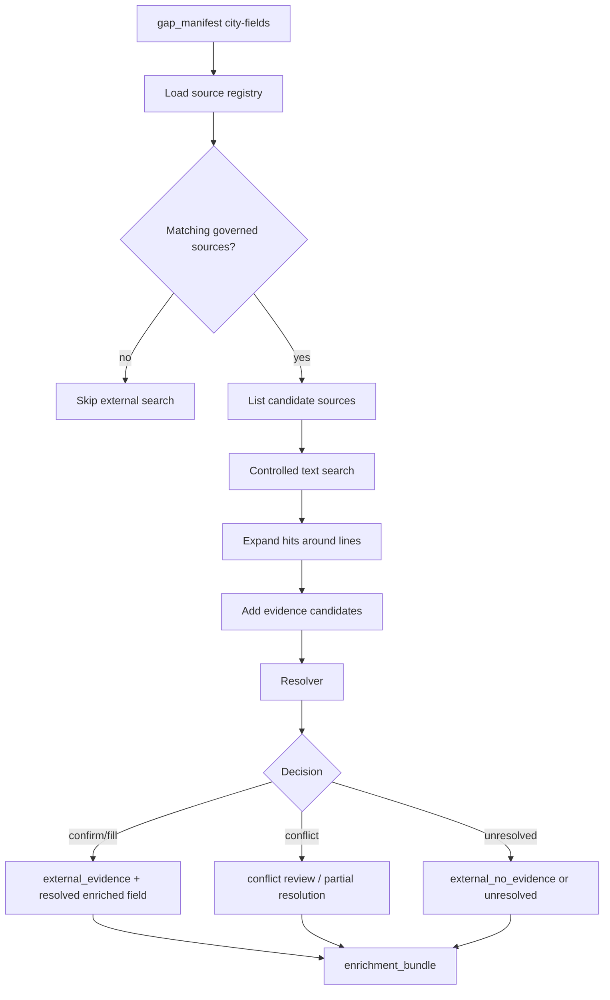

# External Sources

External-source search is the governed enrichment path over curated Markdown sources outside the CCC corpus. It is meant to be more auditable than open web search.

## What It Does

- Loads source metadata from `documents/source_library/`.
- Selects candidate sources for unresolved city-fields.
- Runs controlled search/expansion tools over scoped Markdown.
- Produces evidence candidates, no-evidence records, and resolver decisions.
- Writes an audit artifact when the stage runs.

## Detailed Logic



## Decisions

- **Candidate source selection:** based on source metadata, selected city, sector/topic tags, and configured source library.
- **Evidence candidate:** a line-backed quote that may answer a city-field.
- **Resolver action:** confirms CCC evidence, fills a gap, flags a conflict, or leaves the field unresolved.
- **No evidence:** records that a governed source was searched without finding a usable answer.

## Context Bundle Effect

External sources populate:

```json
{
  "enrichment": {
    "external_evidence": [],
    "external_resolutions": [],
    "external_no_evidence": [],
    "enriched_fields": []
  }
}
```

Resolved external decisions can update `enriched_fields` before assumptions run.

## Key Artifacts

- `stage_files/008_enrichment/external_source_search_audit.json`
- `stage_files/008_enrichment/enrichment_bundle.json`
- `stages/008_enrichment.json`

## Config

- `EXTERNAL_SOURCE_SEARCH_ENABLED`
- governed source metadata under `documents/source_library/`
- external-source model/tool settings in `llm_config.yaml`

## Boundaries And Limitations

- This stage searches curated Markdown only; it is not open web search.
- It may not run if no matching source metadata exists.
- A candidate is not accepted evidence until the resolver validates it.
- The current benchmark coverage is useful but still narrow.
