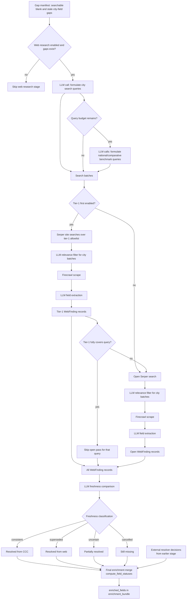

# Web Research

Web research searches live web sources for missing, stale, or benchmark data. It
can optionally search a trusted web allowlist before broader open web results.
It is useful for freshness and context, but a web finding is not automatically a
resolved assumption anchor.

## What It Does

- Plans search batches from the gap manifest and field manifest.
- Searches open web results, with an optional tier-1 `site:<domain>` pre-pass.
- Uses Serper for search and Firecrawl for rendered-page scraping.
- Uses LLM calls to formulate queries, filter relevance, extract `WebFinding`
  records, and compare freshness against CCC excerpts.
- Adds national and comparative benchmark findings when budget is available.

This stage is separate from [External Sources](07_external-sources.md). External
sources search curated local Markdown under `documents/source_library/`; web
research searches live web results. The "tier-1" web allowlist in this document
means `backend/data/tier1_web_sources.yaml`, not
`documents/source_library/tier-1-city-plans/`.

## Input From Gap Analysis

Web research starts from the same gap-analysis output:

- City-specific web searches target `blank_fields` and `stale_flags` from
  `gap_manifest.city_gaps`, but only when the field is marked `searchable` in
  `field_manifest.query_fields`.
- Bundled-only gaps are not directly searched as city web gaps today. If no
  later evidence resolves them, they remain `bundled_only` for derivation or
  assumptions handling.
- National and comparative benchmark batches can use any estimable or derivable
  query field. They exclude `non_estimable` fields and are used as broader
  grounding material, not as direct city values.

## Detailed Logic



National and comparative benchmark batches follow the same search, scrape, and
extract path, but they skip the city-specific relevance/entity check because
they are not meant to resolve one municipality directly.

Benchmark batches are currently budget-gated: city-specific search planning runs
first, and national/comparative benchmark queries are added only when query
budget remains. This can make broader benchmark coverage appear in some runs but
not others. A follow-up implementation should make this explicit, either with a
dedicated env/config flag or with a separate budget so benchmark search is not
silently dependent on leftover city-search capacity.

## Decisions

- **Search plan:** city batches are grouped by region and field category, then
  capped by `max_total_queries_per_run` and `max_queries_per_batch`. High-priority
  blank gaps get larger budgets than small stale-only checks.
- **LLM query formulation:** the planner asks the model for concise search
  queries for city gaps. It then formulates national and comparative benchmark
  queries only if `max_total_queries_per_run` still has unused query budget.
- **Tier-1 vs open:** when `tier1_first_search` is enabled, matching allowlisted
  sources are searched first using `site:<domain>` queries. If high-confidence
  tier-1 findings cover all needed city-field pairs for a query, the broader
  open-web pass for that query is skipped.
- **Relevance filtering:** city-specific search results pass through an LLM
  relevance/entity check before scraping. National and comparative benchmark
  batches skip this city entity check.
- **Field extraction:** scraped page content is sent to an LLM with the exact
  target fields and cities. It should extract only concrete quantitative values
  and must not fabricate missing values.
- **Freshness classification:** web findings are compared with CCC markdown
  excerpts when excerpts exist for the same city. The canonical classifications
  are `consistent`, `superseded`, `uncertain`, and `cancelled`.
- **Anchor eligibility:** only resolved enriched fields with usable values become
  anchors for assumptions. `uncertain`, `cancelled`, `still_missing`, and
  `bundled_only` fields are not resolved anchors.

## Status Outcomes

After search and freshness checking, the context merger runs
`compute_field_statuses(...)`. It turns each city-field gap into an
`enriched_fields` status:

- `resolved`: a usable value was found. With `consistent`, the CCC value remains
  primary; with `superseded`, the web value becomes primary. A web finding with
  no comparable CCC excerpts can also resolve a blank gap.
- `partially_resolved`: CCC evidence remains, but it is stale or uncertain.
- `still_missing`: no usable value was found, or freshness indicates the
  programme was cancelled.
- `bundled_only`: CCC has an aggregate value, but not the requested
  disaggregated line item.

External-source search runs earlier than web research, but its resolver
decisions are passed into the final context merge. In that final merge,
external `fill` and `conflict_review_required` decisions can update the same
city-field status. External `confirm` decisions do not replace a current web
value or a `superseded` freshness result; they mainly preserve or confirm CCC
evidence when web research did not provide a stronger update.

## Example Output

A web-research pass may add a finding, freshness result, and enriched field:

```json
{
  "web_findings": [
    {
      "city": "Krakow",
      "field": "public_dc_charger_count",
      "value": 42,
      "unit": "chargers",
      "source_url": "https://example.invalid/krakow-ev-data",
      "source_type": "government_report",
      "source_date": "2025",
      "extraction_confidence": 0.86,
      "source_tier": "open"
    }
  ],
  "freshness_results": [
    {
      "city": "Krakow",
      "field": "public_dc_charger_count",
      "ccc_value": null,
      "web_value": "42",
      "classification": "uncertain",
      "reason": "CCC excerpts did not contain a comparable charger count.",
      "web_source_url": "https://example.invalid/krakow-ev-data"
    }
  ],
  "enriched_fields": [
    {
      "city": "Krakow",
      "field": "public_dc_charger_count",
      "status": "partially_resolved",
      "value": null,
      "source": "ccc",
      "provenance": {
        "web_alternative": "https://example.invalid/krakow-ev-data",
        "web_value": "42"
      },
      "freshness_flag": "uncertain"
    }
  ]
}
```

The exact values are illustrative, but the field names come from gap analysis
and the status names match the code. The same field appears in all three blocks
because they describe the same city-field through different stages: raw web
extraction, freshness comparison, and final merged status. In this example,
`enriched_fields.value` stays `null` because `uncertain` means the web value is
not trusted as the resolved value or assumption anchor; the candidate web value
is retained under `provenance.web_value`.

## Tier-1 Search Trade-Offs

`tier1_first_search` controls whether the search worker spends Serper calls on
the curated live-web allowlist before falling back to the broader open-web pass.
This allowlist lives at `backend/data/tier1_web_sources.yaml`. It is unrelated to
the local Markdown folder `documents/source_library/tier-1-city-plans/`, which
belongs to the governed external-source stage.

### When `tier1_first_search: true`

Pros:

- More likely to surface higher-trust city plans, official datasets, and governed sources first.
- Better fit for runs where freshness or policy accuracy matters more than search cost.
- Can avoid some open-web calls when tier-1 evidence fully resolves a query.

Cons:

- One planned query can fan out into multiple Serper calls because each matching
  allowlisted domain can trigger its own `site:<domain>` search.
- Retries multiply that fan-out again, so the total call count can grow quickly.
- When the allowlist has weak coverage for a city or topic, the tier-1 pre-pass
  adds cost before the run still has to search the open web.

### When `tier1_first_search: false`

Pros:

- Keeps Serper usage much more predictable and bounded.
- Simpler default for local development and broad benchmarking runs.
- Easier to reason about the cost effect of `max_total_queries_per_run` and
  `max_retries_per_worker`.

Cons:

- The open-web pass may surface noisier or less official sources earlier.
- Strong tier-1 sources can still be missed or underused unless they also rank
  well in the broader web search results.

### Current Default And Likely Next Optimization

The current default keeps `tier1_first_search: false` because the present tier-1
pre-pass is quality-positive but cost-heavy. This is a temporary operating point,
not necessarily the final one.

The most likely future optimization is not simply "tier-1 on" or "tier-1 off",
but a narrower hybrid such as:

- tier-1 enabled only for selected gap types or freshness-sensitive fields
- tier-1 enabled with a smaller per-query domain cap
- tier-1 enabled only after the planner marks a query as high-value
- tier-1 enabled only when the open-web pass does not produce usable evidence

That means the main tuning question is currently: how to preserve more tier-1
source quality without paying the full Serper multiplier on every planned query.

## Context Bundle Effect

Web research contributes:

```json
{
  "enrichment": {
    "web_findings": [],
    "freshness_results": [],
    "enriched_fields": []
  }
}
```

The writer can see city web and freshness evidence through the writer-safe
context, but assumptions only use resolved enriched fields as peer/reference
anchors.

National and comparative benchmark findings are recorded in
`web_research_audit.json`; they are not written as normal city
`enriched_fields`.

## Key Artifacts

- `stage_files/008_enrichment/web_research_audit.json`
- `stage_files/008_enrichment/enrichment_bundle.json`
- `stages/008_enrichment.json`

Useful fields:

- `web_research_audit.metrics.search_batch_count`
- `web_research_audit.metrics.search_query_count` / `planned_search_query_count`: planned search strings produced by the planner, not Serper billable calls.
- `web_research_audit.metrics.actual_serper_call_count`: HTTP requests sent to Serper for the run.
- `web_research_audit.metrics.successful_serper_call_count`: Serper calls that returned a successful response.
- `web_research_audit.metrics.tier1_site_call_count`: Serper calls spent on `site:<domain>` tier-1 pre-search.
- `web_research_audit.metrics.open_call_count`: Serper calls spent on the open-web pass.
- `web_research_audit.metrics.skipped_open_call_count`: open-web calls avoided because tier-1 findings fully covered a query.
- `web_research_audit.metrics.estimated_max_serper_call_count`: upper-bound estimate from planned queries, matching tier-1 sources, and retry count.
- `web_research_audit.outputs.serper_billing_summary`: compact copy of the Serper billing-relevant fields above plus the tier-1/retry config that drove the multiplier.
- `web_research_audit.metrics.web_finding_count`
- `web_research_audit.metrics.national_finding_count`
- `web_research_audit.metrics.comparative_finding_count`

`search_query_count` is kept for compatibility, but it should be read as
"planned queries". Serper usage is represented by `actual_serper_call_count`.
When tier-1 search is enabled, one planned query can become several Serper calls:
one `site:<domain>` call for each matching allowlisted source, plus the open-web
call unless tier-1 evidence fully resolves the query. Retries repeat that work
for unresolved gaps.

The default `llm_config.yaml` keeps `tier1_first_search: false` and
`max_retries_per_worker: 1` to keep live web usage bounded. For a 39-query run,
that makes the expected upper bound roughly 78 Serper calls instead of hundreds.
Lowering `max_total_queries_per_run` only helps when the planner would otherwise
produce more queries than the cap.

## Config

- `WEB_RESEARCH_ENABLED`
- `SERPER_API_KEY`
- `FIRECRAWL_API_KEY`
- `backend/data/tier1_web_sources.yaml`
- web-search caps and model settings in `llm_config.yaml`

## Boundaries And Limitations

- Web research can find data that remains `uncertain` and therefore does not become a resolved anchor.
- National/comparative findings are audit context, not direct city-field
  resolutions in `enrichment.enriched_fields`.
- Open web results are more prone to relevance drift than governed external Markdown.
- Search and scrape behavior depends on external services and can change over time.
- Missing Serper or Firecrawl keys do not stop the whole pipeline, but they leave
  this stage with little or no usable web evidence.
