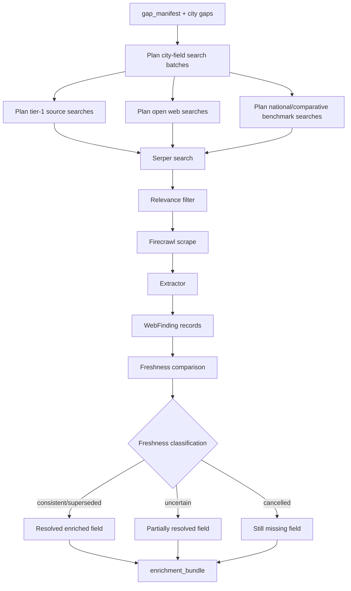

# Web Research

Web research searches tier-1 and open web sources for missing, stale, or benchmark data. It is useful for freshness and context, but a web finding is not automatically a resolved assumption anchor.

## What It Does

- Plans search batches from the gap manifest.
- Prioritizes tier-1 allowlisted sources when configured.
- Uses Serper for search and Firecrawl for rendered-page scraping.
- Extracts structured `WebFinding` records.
- Runs freshness comparisons against CCC values.
- Adds national and comparative benchmark findings when available.

## Detailed Logic



## Decisions

- **Search plan:** generated from estimable fields and city gaps, with caps to control query volume.
- **Tier-1 vs open:** tier-1 sources are preferred where the allowlist has relevant coverage.
- **Freshness classification:** determines whether a web finding confirms, updates, weakly informs, or invalidates a field.
- **Anchor eligibility:** only resolved enriched fields with usable values become anchors for assumptions.

## Tier-1 Search Trade-Offs

`tier1_first_search` controls whether the search worker spends Serper calls on the
curated tier-1 allowlist before falling back to the broader open-web pass.

### When `tier1_first_search: true`

Pros:

- More likely to surface higher-trust city plans, official datasets, and governed sources first.
- Better fit for runs where freshness or policy accuracy matters more than search cost.
- Can avoid some open-web calls when tier-1 evidence fully resolves a query.

Cons:

- One planned query can fan out into multiple Serper calls because each matching
  allowlisted domain can trigger its own `site:<domain>` search.
- Retries multiply that fan-out again, so the total call count can grow quickly.
- When the allowlist has weak coverage for a city or topic, the tier-1 pre-pass
  adds cost before the run still has to search the open web.

### When `tier1_first_search: false`

Pros:

- Keeps Serper usage much more predictable and bounded.
- Simpler default for local development and broad benchmarking runs.
- Easier to reason about the cost effect of `max_total_queries_per_run` and
  `max_retries_per_worker`.

Cons:

- The open-web pass may surface noisier or less official sources earlier.
- Strong tier-1 sources can still be missed or underused unless they also rank
  well in the broader web search results.

### Current Default And Likely Next Optimization

The current default keeps `tier1_first_search: false` because the present tier-1
pre-pass is quality-positive but cost-heavy. This is a temporary operating point,
not necessarily the final one.

The most likely future optimization is not simply "tier-1 on" or "tier-1 off",
but a narrower hybrid such as:

- tier-1 enabled only for selected gap types or freshness-sensitive fields
- tier-1 enabled with a smaller per-query domain cap
- tier-1 enabled only after the planner marks a query as high-value
- tier-1 enabled only when the open-web pass does not produce usable evidence

That means the main tuning question is currently: how to preserve more tier-1
source quality without paying the full Serper multiplier on every planned query.

## Context Bundle Effect

Web research contributes:

```json
{
  "enrichment": {
    "web_findings": [],
    "freshness_results": [],
    "enriched_fields": []
  }
}
```

The writer can see web and freshness evidence through the writer-safe context, but assumptions only use resolved enriched fields as peer/reference anchors.

## Key Artifacts

- `stage_files/008_enrichment/web_research_audit.json`
- `stage_files/008_enrichment/enrichment_bundle.json`
- `stages/008_enrichment.json`

Useful fields:

- `web_research_audit.metrics.search_batch_count`
- `web_research_audit.metrics.search_query_count` / `planned_search_query_count`: planned search strings produced by the planner, not Serper billable calls.
- `web_research_audit.metrics.actual_serper_call_count`: HTTP requests sent to Serper for the run.
- `web_research_audit.metrics.successful_serper_call_count`: Serper calls that returned a successful response.
- `web_research_audit.metrics.tier1_site_call_count`: Serper calls spent on `site:<domain>` tier-1 pre-search.
- `web_research_audit.metrics.open_call_count`: Serper calls spent on the open-web pass.
- `web_research_audit.metrics.skipped_open_call_count`: open-web calls avoided because tier-1 findings fully covered a query.
- `web_research_audit.metrics.estimated_max_serper_call_count`: upper-bound estimate from planned queries, matching tier-1 sources, and retry count.
- `web_research_audit.outputs.serper_billing_summary`: compact copy of the Serper billing-relevant fields above plus the tier-1/retry config that drove the multiplier.
- `web_research_audit.metrics.web_finding_count`
- `web_research_audit.metrics.national_finding_count`
- `web_research_audit.metrics.comparative_finding_count`

`search_query_count` is kept for compatibility, but it should be read as
"planned queries". Serper usage is represented by `actual_serper_call_count`.
When tier-1 search is enabled, one planned query can become several Serper calls:
one `site:<domain>` call for each matching allowlisted source, plus the open-web
call unless tier-1 evidence fully resolves the query. Retries repeat that work
for unresolved gaps.

The default `llm_config.yaml` keeps `tier1_first_search: false` and
`max_retries_per_worker: 1` to keep live web usage bounded. For a 39-query run,
that makes the expected upper bound roughly 78 Serper calls instead of hundreds.
Lowering `max_total_queries_per_run` only helps when the planner would otherwise
produce more queries than the cap.

## Config

- `WEB_RESEARCH_ENABLED`
- `SERPER_API_KEY`
- `FIRECRAWL_API_KEY`
- `backend/data/tier1_web_sources.yaml`
- web-search caps and model settings in `llm_config.yaml`

## Boundaries And Limitations

- Web research can find data that remains `uncertain` and therefore does not become a resolved anchor.
- National/comparative findings are collected for benchmark context, but current assumption pre-checks can still stop estimation if no resolved anchors exist.
- Open web results are more prone to relevance drift than governed external Markdown.
- Search and scrape behavior depends on external services and can change over time.
