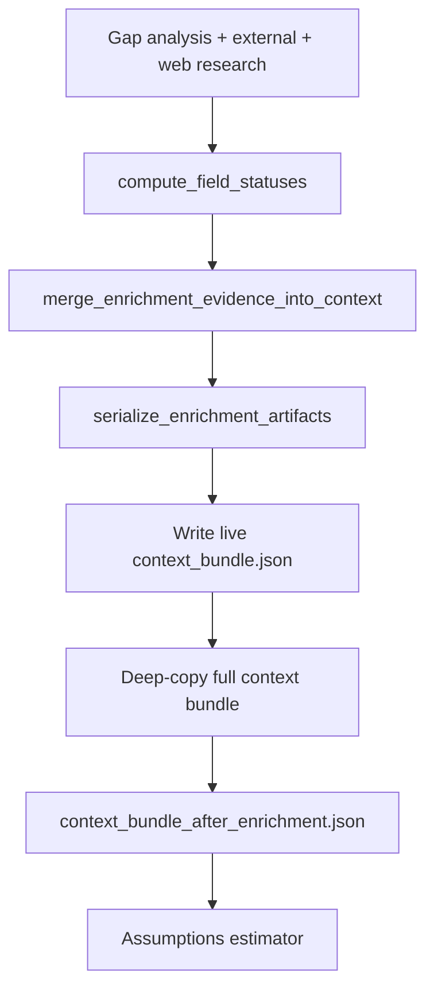

# Enrichment Context Handoff

The enrichment context handoff stage (`009_enrichment_context_handoff`) freezes the full runtime context immediately after stage `008_enrichment` has merged evidence and serialized `enrichment_bundle.json`. It creates an immutable checkpoint before the assumptions estimator runs.

The actual evidence/status merge happens one stage earlier, inside
`compute_field_statuses(...)` in
`backend/modules/web_researcher/context_merger.py`. This handoff only persists
the already-merged result.

## What It Does

- Deep-copies the current `context_bundle.json` into `context_bundle_after_enrichment.json`.
- Records stage metrics such as enriched-field count, web-finding count, and external-evidence count.
- Marks the enrichment pipeline checkpoint in run progress and `stages/009_enrichment_context_handoff.json`.

## Detailed Logic

## Decisions

- **Full snapshot, not a subset:** unlike the writer, the handoff stores the entire context bundle at this point, including diagnostics the writer later filters out.
- **Timing:** the handoff happens after `enrichment_bundle.json` is written but before assumptions mutate `context_bundle.assumptions`.
- **No merge logic here:** external and web evidence have already been reconciled into `enriched_fields`; this stage only snapshots the result.
- **Skipped when enrichment disabled:** if `ENRICHMENT_ENABLED` is false, enrichment and this handoff are not planned or executed.

## Context Bundle Effect

At handoff time, the bundle typically includes:

- `markdown` with accepted CCC excerpts
- `enrichment` with `field_manifest`, `gap_manifest`, `enriched_fields`, web/external/freshness evidence, and meta
- no top-level `assumptions` block yet (added in stage `010_assumptions`)

Comparing `context_bundle_after_markdown.json` and `context_bundle_after_enrichment.json` shows exactly what enrichment added.

## Key Artifacts

- `stage_files/009_enrichment_context_handoff/context_bundle_after_enrichment.json`
- `stages/009_enrichment_context_handoff.json`
- upstream: `stage_files/008_enrichment/enrichment_bundle.json`

## Inspection Tips

When debugging enrichment:

1. Read `enrichment_bundle.json` for structured manifests and resolved fields.
2. Read `context_bundle_after_enrichment.json` to see how those records appear in the live runtime object.
3. Compare against `context_bundle_after_assumptions.json` after assumptions to see estimator outputs.

## Boundaries And Limitations

- The handoff snapshot is a point-in-time copy; later stages continue updating the root `context_bundle.json`.
- Web findings and external evidence in the snapshot are not automatically writer-ready; the writer uses a filtered projection.
- This stage performs no LLM work; it only persists state.
