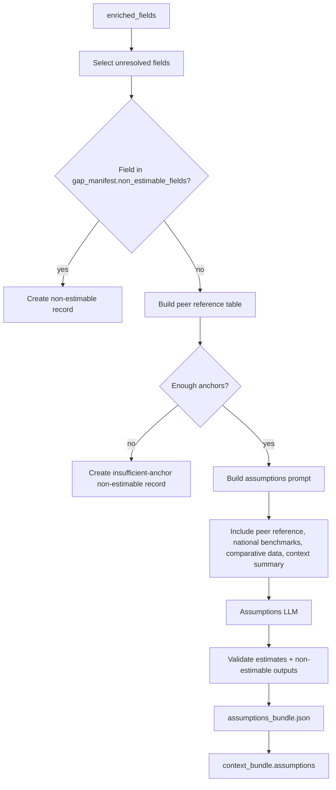

# Assumptions

The automatic assumptions estimator is the last-resort step for unresolved enriched fields. It either estimates a value with an explicit method and confidence or marks the field non-estimable.

This is separate from the post-run Assumptions Review API/workspace, which lets users discover, edit, and apply missing-data assumptions after a run.

## What It Does

- Receives `enriched_fields` from enrichment.
- Selects fields with `still_missing`, `partially_resolved`, or `bundled_only` status.
- Filters out fields classified as non-estimable by gap analysis.
- Builds peer/reference anchors from resolved enriched fields.
- Checks anchor sufficiency before calling the assumptions LLM.
- Writes estimates and non-estimable records.

## Detailed Logic



## Estimation Methods

| Method | Meaning |
| --- | --- |
| `national_regional_average` | Estimate from national or regional benchmark data. |
| `peer_city_proxy` | Estimate from resolved values for the same field in comparable cities. |
| `expert_heuristic_scaling` | Use a wider-uncertainty heuristic when stronger anchors are unavailable. |

## What "Peer Values" Means

Peer values are not a separately configured peer-city list today. They are resolved same-field values already present in `enriched_fields`.

A field counts as a peer/reference anchor only when:

- it has the same field name,
- `status == "resolved"`,
- `value` is not null,
- confidence passes the estimator threshold.

For single-city runs, peer anchors are often unavailable unless enrichment resolved another same-field record or the run included additional cities with resolved values.

## Context Bundle Effect

Assumptions write a top-level block:

```json
{
  "assumptions": {
    "assumptions": [],
    "non_estimable": [],
    "saturation_warning": null,
    "meta": {}
  }
}
```

The writer uses this to label estimated values and to explain non-estimable gaps.

## Key Artifacts

- `stage_files/010_assumptions/assumptions.json`
- `stage_files/010_assumptions/non_estimable.json`
- `stage_files/010_assumptions/assumptions_bundle.json`
- `stage_files/010_assumptions/assumptions_stage.json`
- `stage_files/011_assumptions_context_handoff/context_bundle_after_assumptions.json`

## Config

- `ENRICHMENT_ENABLED`
- assumptions estimator model settings in `llm_config.yaml`
- upstream web/external-source settings that determine whether resolved anchors exist

## Boundaries And Limitations

- The automatic estimator is intentionally conservative: fields can become non-estimable before the assumptions LLM runs if anchor sufficiency fails.
- Current anchor checks rely on resolved enriched fields; uncertain web findings are not enough.
- National and comparative web findings are available to the assumptions prompt only if the field passes the pre-check.
- The frontend should avoid saying "no source data" when web findings exist but no validated/resolved anchors exist.
