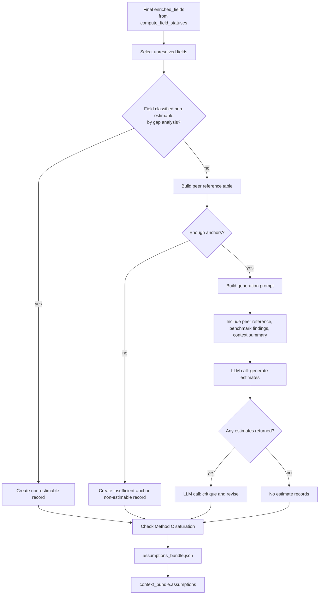

# Assumptions

The automatic assumptions estimator is the last-resort step for unresolved
`enriched_fields`. It either estimates a value with an explicit method and
confidence, or explains why the field should stay non-estimable.

This stage runs after the final enrichment merge. It does not rerun gap
analysis, external-source search, web search, or freshness checks, and it does
not turn an unresolved `enriched_fields` record into a resolved source value.
Instead, it writes a separate top-level `context_bundle.assumptions` block that
the writer can label as estimated evidence.

This is separate from the post-run Assumptions Review API/workspace, which lets
users discover, edit, and apply missing-data assumptions after a run.

## What It Does

- Receives `enriched_fields` from enrichment.
- Selects fields with `still_missing`, `partially_resolved`, or `bundled_only` status.
- Filters out fields classified as non-estimable by gap analysis.
- Builds peer/reference anchors from resolved enriched fields.
- Checks anchor sufficiency before calling the assumptions LLM.
- Calls the assumptions LLM to generate estimates, then usually calls it again
  to critique/revise those estimates.
- Writes estimates, non-estimable records, and a saturation warning when too
  many estimates rely on the weakest method.

## Detailed Logic



## Estimation Methods

| Method | Meaning |
| --- | --- |
| `national_regional_average` | Method A. Use national or regional benchmark findings when the city has the quantity but is missing a unit cost or similar benchmarkable value. |
| `peer_city_proxy` | Method B. Ratio-scale from resolved values for the same field in other cities. |
| `expert_heuristic_scaling` | Method C. Use wider-uncertainty expert scaling when stronger anchors are unavailable. |

The prompt asks the LLM to apply this priority ladder in order. The output is
always an estimate range (`low`, `mid`, `high`) with a confidence label, not a
single point value.

## What "Peer Values" Means

Peer values are not a separately configured peer-city list today. They are
resolved same-field values already present in `enriched_fields`.

A field counts as a peer/reference anchor only when:

- it has the same field name,
- `status == "resolved"`,
- `value` is not null,
- confidence passes the estimator threshold.

Field names are operational handles created by the gap-analysis field
decomposer. They are not backed by a canonical taxonomy today. This is usually
consistent within one run because the first gap-analysis LLM call creates the
fixed `query_fields` list and later stages reuse those field strings. However,
similar concepts with different names, such as `dc_chargers`,
`public_dc_charger_count`, and `fast_charging_points`, are not automatically
treated as peers. That can reduce available anchors even when the evidence is
conceptually close.

Anchor sufficiency is checked before the assumptions LLM runs. A field can pass
with at least two peer values, or with one high-confidence CCC-sourced anchor.
A single web-sourced peer value is not enough by itself.

For single-city runs, peer anchors are often unavailable unless enrichment
resolved another same-field record or the run included additional cities with
resolved values.

## What Gets Estimated

Assumptions only consider fields already present in final `enriched_fields` with
one of these statuses:

- `still_missing`: no usable value was found.
- `partially_resolved`: there is some evidence, but it is stale, uncertain, or
  conflicted.
- `bundled_only`: CCC has an aggregate value but not the requested
  disaggregated line item.

They skip fields that gap analysis classified as `non_estimable`, for example
qualitative, legal, or highly city-specific data. Those fields are carried as
`non_estimable` records with a recommendation instead of an estimate.

Uncertain web values can still appear in provenance or audit records, but they
do not count as resolved anchors unless the final `enriched_fields` status is
`resolved` with a usable value.

## Benchmark Inputs

National and comparative web findings can be included in the assumptions prompt
as supporting context:

- National/regional findings support Method A.
- Comparative findings can support Method C.

They are not direct city-field resolutions. Also, benchmark findings are only
available when web research produced them and the field passed the pre-LLM
anchor sufficiency check.

## Context Bundle Effect

Assumptions write a top-level block:

```json
{
  "assumptions": {
    "assumptions": [],
    "non_estimable": [],
    "saturation_warning": null,
    "meta": {}
  }
}
```

The writer uses this to label estimated values and to explain non-estimable gaps.

Example:

```json
{
  "assumptions": {
    "assumptions": [
      {
        "city": "Krakow",
        "field_name": "public_dc_charger_count",
        "gap_description": "Missing public_dc_charger_count for Krakow",
        "method_used": "peer_city_proxy",
        "estimate": {"low": 30, "mid": 42, "high": 58},
        "confidence": "MEDIUM",
        "reference_data": "Resolved same-field values from peer cities.",
        "rationale": "Scaled from peer-city charger counts using population.",
        "basis": "Automatic estimate from resolved peer anchors.",
        "is_replaceable": true
      }
    ],
    "non_estimable": [],
    "saturation_warning": null,
    "meta": {
      "assumption_count": 1,
      "non_estimable_output_count": 0
    }
  }
}
```

This estimate is not the same as a resolved web or external-source value. It is
an explicit assumption and should remain labeled as such.

## Key Artifacts

- `stage_files/010_assumptions/assumptions.json`
- `stage_files/010_assumptions/non_estimable.json`
- `stage_files/010_assumptions/assumptions_bundle.json`
- `stage_files/010_assumptions/assumptions_stage.json`
- `stage_files/011_assumptions_context_handoff/context_bundle_after_assumptions.json`

## Config

- `ENRICHMENT_ENABLED`
- assumptions estimator model settings in `llm_config.yaml`
- upstream web/external-source settings that determine whether resolved anchors exist

## Boundaries And Limitations

- The automatic estimator is intentionally conservative: fields can become non-estimable before the assumptions LLM runs if anchor sufficiency fails.
- Current anchor checks rely on resolved enriched fields; uncertain web findings are not enough.
- National and comparative web findings are available to the assumptions prompt only if the field passes the pre-check.
- If more than 60% of generated estimates use `expert_heuristic_scaling`, the stage adds a saturation warning so the writer can explain that the estimates are broad order-of-magnitude figures.
- The frontend should avoid saying "no source data" when web findings exist but no validated/resolved anchors exist.
