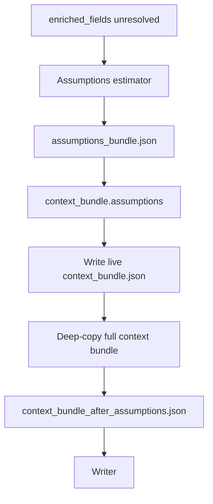

# Assumptions Context Handoff

The assumptions context handoff stage (`011_assumptions_context_handoff`) freezes the full runtime context after the automatic assumptions estimator finishes. It is the last context checkpoint before the writer runs.

## What It Does

- Deep-copies the current `context_bundle.json` into `context_bundle_after_assumptions.json`.
- Captures both resolved assumption estimates and non-estimable records written in stage `010_assumptions`.
- Records metrics such as assumption count, non-estimable count, and top-level context keys.
- Completes the enrichment pipeline before control returns to the orchestrator for writing.

## Detailed Logic



## Decisions

- **Last enrichment checkpoint:** this snapshot is the best place to inspect the full pre-writer context, including CCC excerpts, enrichment evidence, and assumption outputs together.
- **Separate from post-run review:** the Assumptions Review API can edit assumptions and regenerate output after a run completes; that workflow writes different artifacts (`edited.json`, `final_with_assumptions.md`) and does not replace this automatic handoff snapshot.
- **Skipped when enrichment disabled:** assumptions and this handoff are disabled in `planned_stages.json` when enrichment is off.

## Context Bundle Effect

After assumptions, the bundle adds a top-level block:

```json
{
  "assumptions": {
    "assumptions": [],
    "non_estimable": [],
    "saturation_warning": null,
    "meta": {}
  }
}
```

The handoff file contains the entire bundle, not just the assumptions subtree.

## Key Artifacts

- `stage_files/011_assumptions_context_handoff/context_bundle_after_assumptions.json`
- `stages/011_assumptions_context_handoff.json`
- upstream: `stage_files/010_assumptions/assumptions_bundle.json`

## Inspection Tips

Use this snapshot when you need to answer:

- What did the estimator produce versus what enrichment already resolved?
- Which fields were marked non-estimable before writing?
- Does the writer have assumption labels available for unresolved gaps?

## Boundaries And Limitations

- The handoff does not validate citation coverage or final answer quality; that happens in the writer stage.
- Non-estimable records are intentional outcomes, not stage failures.
- When enrichment is disabled, runs jump from markdown context handoff directly to the writer with no assumptions block.
