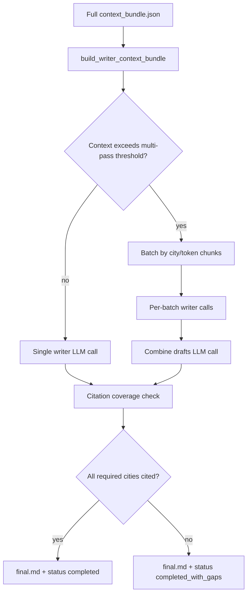

# Writer

The writer stage (`014_writer`) turns the accumulated context bundle into the final sourced Markdown report (`final.md`). It is the last content-producing step before run finalization.

## What It Does

- Builds a writer-safe projection of `context_bundle.json` (CCC excerpts plus filtered enrichment and assumptions fields).
- Plans single-pass or multi-pass generation based on token budget and city scope.
- Calls the writer LLM to draft the answer with citation expectations.
- Checks per-city citation coverage for `city_by_city` and related modes.
- Writes `final.md`, records writer diagnostics, and sets the terminal run status.

## Detailed Logic

## Decisions

- **Writer-safe subset:** the writer does not receive every diagnostic field from enrichment. `build_writer_context_bundle()` keeps excerpts, selected-city scope, and prompt-relevant enrichment/assumptions slices.
- **Analysis mode:** `aggregate` produces one combined answer; `city_by_city` expects city-scoped coverage and can batch per city when context is large.
- **Multi-pass:** when input tokens exceed `writer.multi_pass_threshold_tokens`, the writer splits work into batches, persists multi-pass artifacts, and combines drafts with a second LLM pass.
- **Terminal status:** full citation coverage yields `completed`; partial coverage yields `completed_with_gaps` while still writing the draft.

## Context Bundle Effect

The writer reads the context bundle but does not append new evidence blocks to it. It may record:

- `writer_citation_coverage` metadata on the run
- optional multi-pass diagnostics under `stage_files/012_writer_multi_pass/` when batching occurs

The primary user-facing output is `final.md` at the run root.

## Key Artifacts

- `final.md`
- `stages/014_writer.json`
- `stages/013_writer_citation_coverage.json` when coverage is recorded
- `stage_files/012_writer_multi_pass/` when multi-pass batching runs (plan, batch drafts)
- API export helpers can render the writer-safe subset as JSON or Markdown for inspection

## Config

- `writer.context_window_tokens`
- `writer.max_output_tokens`
- `writer.max_input_tokens` / `writer.input_token_reserve`
- `writer.multi_pass_threshold_tokens`
- `writer.multi_pass_chunk_tokens`
- writer model settings in `llm_config.yaml`

## Boundaries And Limitations

- The writer depends on upstream quality: weak retrieval, rejected excerpts, or missing anchors limit what citations can cover.
- Assumption estimates may appear in the report but must be labeled as estimates, not primary CCC citations.
- Post-run Assumptions Review can regenerate a revised report (`final_with_assumptions.md`) without rerunning the full pipeline.
- Partial citation coverage is a completed run with a documented gap, not an automatic rewrite loop.
