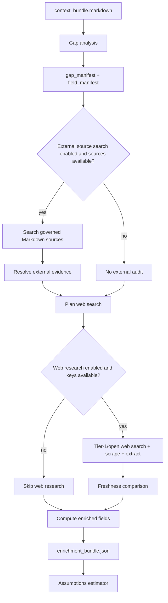

# Enrichment Overview

Enrichment starts after CCC markdown extraction. It tries to understand missing or stale data needs, search governed and web sources, and prepare unresolved gaps for assumptions.

## What It Does

The enrichment phase currently contains:

1. [Gap Analysis](gap-analysis.md)
2. [External Sources](external-sources.md)
3. [Web Research](web-research.md)
4. [Assumptions](assumptions.md)

These steps share models under `backend/modules/web_researcher/`, and the main persisted output is `stage_files/008_enrichment/enrichment_bundle.json`.

## Detailed Logic



## Context Bundle Effect

Enrichment writes a top-level `enrichment` block:

```json
{
  "enrichment": {
    "field_manifest": {},
    "gap_manifest": {},
    "enriched_fields": [],
    "web_findings": [],
    "freshness_results": [],
    "external_evidence": [],
    "external_resolutions": [],
    "external_no_evidence": [],
    "meta": {}
  }
}
```

Assumptions are written separately to top-level `context_bundle.assumptions`, not inside `context_bundle.enrichment`.

## Key Artifacts

- `stage_files/008_enrichment/enrichment_bundle.json`
- `stage_files/008_enrichment/external_source_search_audit.json` when governed external search runs
- `stage_files/008_enrichment/web_research_audit.json` when web research has trace output
- `stage_files/009_enrichment_context_handoff/context_bundle_after_enrichment.json`
- `stage_files/010_assumptions/assumptions_bundle.json`

## Important Decisions

- CCC excerpts remain the primary evidence path.
- External governed Markdown can confirm, fill, conflict with, or leave unresolved CCC evidence.
- Web findings are not automatically trusted. Freshness checks can classify them as consistent, superseded, uncertain, or cancelled.
- Only resolved enriched fields become assumption anchors.

## Boundaries And Limitations

- Enrichment is not one independent service yet; it is a coordinated set of helpers under `web_researcher`.
- Web search may find relevant-looking values that do not become resolved anchors.
- The frontend displays derived `stage_details` from artifacts, but `enrichment_bundle.json` and `assumptions_bundle.json` remain the source of truth.
