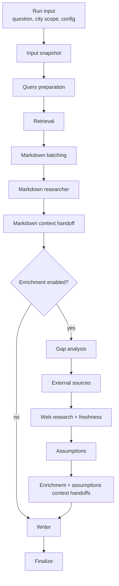
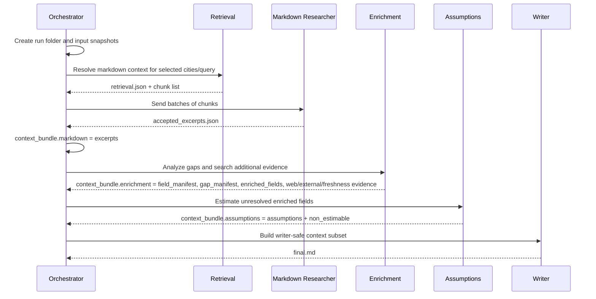

# Pipeline Overview

This project builds a sourced report from city CCC Markdown files, optional governed external Markdown sources, optional web research, and a final writer step. The central handoff object is `context_bundle.json`; stages add structured blocks to it as the run progresses.

## High-Level Flow

## Context Bundle Evolution

## Main Artifact Stages

| Stage | Purpose | Key artifacts |
| --- | --- | --- |
| `001_input_snapshot` | Reproducibility and planned-stage contract | `execution_snapshot.json`, `config_snapshot.json`, `documents_snapshot.json`, `planned_stages.json` |
| `002_query_preparation` | Preserve original question and retrieval queries | `research_question.json` |
| `003_retrieval` | Select candidate CCC chunks | `retrieval.json` |
| `005_markdown_batching` | Package chunks for LLM extraction | `batches.json`, `source_chunk_index.json` |
| `006_markdown_extraction` | Extract cited CCC evidence | `accepted_excerpts.json`, `rejected_chunks.json`, `decision_audit.json`, `city_summary.json` |
| `007_markdown_context_handoff` | Freeze post-CCC context | `context_bundle_after_markdown.json` |
| `008_enrichment` | Add field/gap analysis and extra evidence | `enrichment_bundle.json`, optional `external_source_search_audit.json`, optional `web_research_audit.json` |
| `009_enrichment_context_handoff` | Freeze post-enrichment context | `context_bundle_after_enrichment.json` |
| `010_assumptions` | Estimate or mark unresolved gaps | `assumptions_bundle.json`, `assumptions_stage.json` |
| `011_assumptions_context_handoff` | Freeze post-assumptions context | `context_bundle_after_assumptions.json` |
| `014_writer` | Produce final answer | `final.md` |

## Boundaries

- Retrieval and markdown extraction are the primary CCC evidence path.
- Enrichment adds structured gap/evidence metadata; it does not replace CCC excerpts.
- Assumptions are last resort and should be clearly labeled as estimates or non-estimable gaps.
- The writer consumes a writer-safe projection of the context, not every diagnostic field.

## Common Inspection Path

For a run such as `output/20260630_1424`, inspect in this order:

1. `stage_files/002_query_preparation/research_question.json`
2. `stage_files/003_retrieval/retrieval.json`
3. `stage_files/006_markdown_extraction/accepted_excerpts.json`
4. `stage_files/008_enrichment/enrichment_bundle.json`
5. `stage_files/010_assumptions/assumptions_bundle.json`
6. `context_bundle.json`
7. `final.md`
