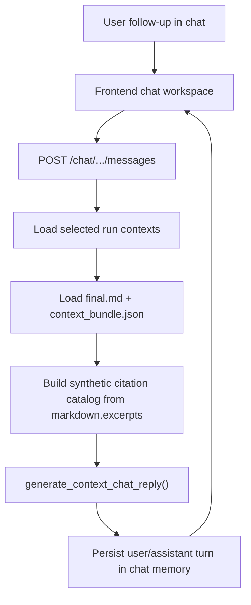
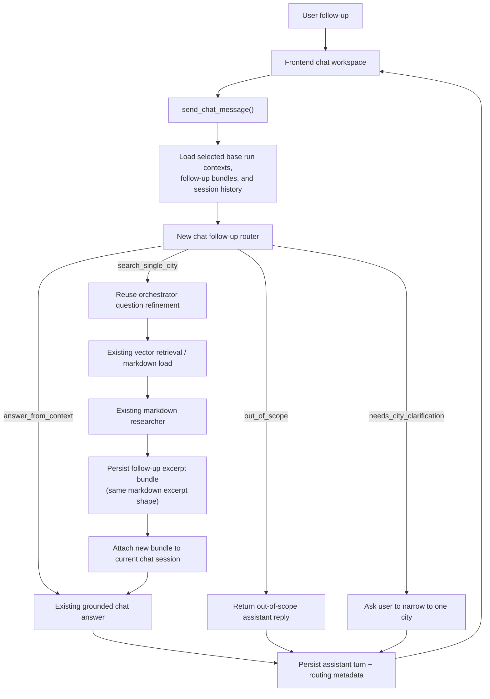
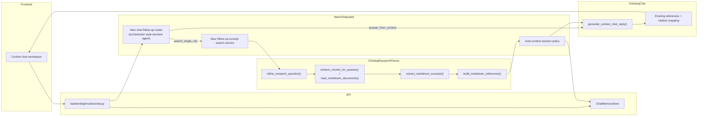

# Chat Follow-up Rework

## Purpose

This document describes the architecture rework needed to make chat capable of asking follow-up questions about a single city without losing the current grounded-answer guarantees.

The design keeps the existing retrieval and vector-store infrastructure. It adds a routing layer in front of chat so the system can:

1. Answer directly from the current context when the excerpts already support the question.
2. Refuse clearly unrelated questions and tell the user to start a new chat.
3. Trigger a new one-city search when the current context is not sufficient.

The key bias for this rework is deliberate over-searching: if the model is uncertain whether the current context is enough, it should choose a new search rather than hallucinate or stay too narrow.

## Goals

- Keep chat grounded in project context and existing citation behavior.
- Reuse the current orchestrator question-refinement mechanics.
- Reuse the existing question-refinement, retrieval, markdown extraction, and reference-building path for fresh searches.
- Limit follow-up searches to exactly one city.
- Avoid any vector-store schema, embedding, or indexing redesign.

## Non-goals

- No vector-store redesign.
- No change to chunk schema, manifest schema, or retrieval thresholds as part of this rework.
- No broad chat agent rewrite into a general web assistant.
- No multi-city follow-up search in the first version.

## Current chat setup

### Current request path

Today the chat flow is centered in `backend/api/routes/chat.py` and `backend/api/services/context_chat.py`.

1. The frontend chat workspace (`frontend/src/components/context-chat-workspace.tsx`) sends a message to `POST /api/v1/runs/{run_id}/chat/sessions/{conversation_id}/messages`.
2. The backend loads the selected run contexts from persisted run artifacts.
3. For each selected run it loads:
   - `final.md`
   - `context_bundle.json`
4. It builds a synthetic citation catalog from `context_bundle["markdown"]["excerpts"]`.
5. It calls `generate_context_chat_reply(...)`.
6. The chat model answers using only the supplied stored context.
7. The user and assistant turn are persisted under `output/<run_id>/chat/<conversation_id>.json`.

### What the current chat can do well

- It stays grounded in completed run artifacts.
- It can cite extracted evidence through stable `[ref_n]` tokens.
- It can compare multiple already-completed runs if those runs are selected as contexts.

### Current hard limitation

The current chat never triggers new retrieval or new extraction.

If the needed fact is not already inside the loaded run artifacts, chat can only say the information is missing. It cannot ask the research pipeline to refresh context for a city.

### Current-state flow



## Problems to solve

1. Chat cannot deepen research for a city when current excerpts are not enough.
2. Chat does not distinguish between:
   - answerable from current context,
   - relevant but missing context,
   - completely unrelated questions.
3. The current path has no mechanism to reuse the orchestrator question refinement for chat follow-ups.
4. If we add search naively, chat may accumulate too many ad hoc contexts and hit the existing token cap in an unstable way.

## Target behavior

For each new chat message, the system should make an explicit routing decision before generating the answer.

### Route outcomes

#### `answer_from_context`

Use the existing chat answer path with the currently selected contexts only.

Use this only when the current excerpts/context are clearly enough to answer. This should be the strict path, not the default path.

#### `search_single_city`

Trigger a fresh one-city excerpt search when the follow-up is relevant but current context is not enough.

This should be the preferred path whenever the router has any meaningful uncertainty.

#### `out_of_scope`

Do not run retrieval or extraction. Respond that the question is outside the current document context and the user should start a new chat for that topic.

Example: weather, sports, current events unrelated to the city report context.

#### `needs_city_clarification`

Do not run retrieval or extraction. Ask the user to narrow the follow-up to one city.

This covers questions that need a new search but mention zero cities or multiple cities.

## Proposed architecture

### High-level design

Add a new router step before `generate_context_chat_reply(...)`.

The router will:

- inspect the user message,
- inspect the current chat context summary and excerpts,
- decide whether current context is sufficient,
- determine whether the message is still in-domain,
- extract exactly one target city when a new search is needed,
- rewrite the search question for the existing research path.

If the router chooses `search_single_city`, the backend should run a one-city follow-up research flow, persist a chat-owned excerpt bundle, attach that bundle to the current chat session, and answer using the refreshed context.

The follow-up bundle should mirror the current markdown excerpt shape as closely as possible so chat can consume it the same way it consumes `context_bundle["markdown"]` today.

### Decision policy

The router prompt should be explicitly conservative:

- If the answer is obviously supported by current excerpts, return `answer_from_context`.
- If the question is unrelated to the current domain, return `out_of_scope`.
- If the question is relevant but there is any uncertainty about sufficiency, return `search_single_city`.
- If a new search is required but the target city is not exactly one city, return `needs_city_clarification`.

This "search on uncertainty" rule is the main behavioral change.

## Target runtime flow



## Why use a follow-up excerpt bundle

The follow-up search should stop after question refinement, retrieval, markdown extraction, and reference creation. It should not run the writer and should not create a second full answer document.

Reasons:

- Chat only needs grounded excerpts and references.
- It lets the follow-up artifact reuse the same excerpt structure already used in `context_bundle["markdown"]`.
- It reduces latency and token cost by skipping the writer.
- It avoids creating unnecessary `final.md` artifacts for follow-up questions.
- It still reuses the existing retrieval, extraction, and reference-building components.
- It avoids touching the vector-store layer.

Tradeoff:

- Chat must load two context source types:
  - completed run contexts
  - chat-owned follow-up excerpt bundles

That tradeoff is acceptable because the follow-up bundle can still be normalized into the same excerpt-oriented chat context.

## Concrete component changes

### 1. New chat router model and prompt

Add a new structured decision model near the orchestrator models, for example in `backend/modules/orchestrator/models.py`:

```python
class ChatFollowupDecision(BaseModel):
    action: Literal[
        "answer_from_context",
        "search_single_city",
        "out_of_scope",
        "needs_city_clarification",
    ]
    reason: str
    target_city: str | None = None
    rewritten_question: str | None = None
    confidence: float | None = None
```

Add a dedicated prompt, for example `backend/prompts/chat_followup_router_system.md`.

The prompt should:

- describe the current document/chat scope,
- tell the model to prefer search when uncertain,
- forbid multi-city search,
- tell it to reject unrelated questions,
- return only the structured tool output.

### 2. Extend orchestrator agent usage for chat routing

Add a new orchestrator-style helper in `backend/modules/orchestrator/agent.py`, for example:

- `build_chat_followup_router_agent(...)`
- `route_chat_followup(...)`

This keeps the new routing logic aligned with the current orchestrator pattern instead of inventing a separate agent framework.

### 3. Add a pre-answer routing step in `send_chat_message`

Refactor `backend/api/routes/chat.py` so `send_chat_message(...)` does this in order:

1. Load session contexts and history.
2. Build a compact routing payload from:
   - current user message,
   - original run question,
   - selected base run ids,
   - selected follow-up bundle ids,
   - inspected/selected city names from context bundles,
   - current excerpt catalog,
   - recent history.
3. Call the new router.
4. Branch on the router action.

The existing `generate_context_chat_reply(...)` should stay as the final answer generator, not the router.

### 4. Add a dedicated follow-up excerpt bundle

Add a chat-owned follow-up artifact that mirrors the current markdown excerpt payload closely enough to be consumed with the same excerpt logic.

Suggested artifact path:

`output/<parent_run_id>/chat/<conversation_id>/followups/<bundle_id>/context_bundle.json`

Suggested bundle contents:

```json
{
  "bundle_id": "fup_ab12_003_munich",
  "parent_run_id": "run-chat",
  "conversation_id": "ab12",
  "source": "chat_followup",
  "target_city": "Munich",
  "research_question": "What does Munich say about rooftop solar deployment?",
  "retrieval_queries": [
    "Munich rooftop solar deployment policy",
    "PV rooftop targets timelines metrics"
  ],
  "markdown": {
    "status": "success",
    "selected_city_names": ["Munich"],
    "inspected_city_names": ["Munich"],
    "excerpts": [],
    "excerpt_count": 0
  }
}
```

The important constraint is that `markdown.excerpts` should use the same structure as current run bundles so chat can merge both sources without special answer-generation logic.

### 5. Trigger one-city search through excerpts-only research mechanics

For `search_single_city`, run a dedicated follow-up research service that reuses existing building blocks:

- `refine_research_question(...)`
- `retrieve_chunks_for_queries(...)` or `load_markdown_documents(...)`
- `extract_markdown_excerpts(...)`
- `build_markdown_references(...)`

Inputs:

- `question=rewritten_question`
- `selected_cities=[target_city]`
- the same config and API key override already used by chat

This can run synchronously inside the chat request in the first implementation.

The writer is intentionally excluded from this path.

Recommended bundle id pattern:

`fup_<conversation_id_short>_<turn_index>_<city_key>`

This keeps follow-up bundles debuggable and scoped to chat.

### 6. Auto-attach follow-up excerpt bundles to the session

After the follow-up search completes successfully:

- append the new bundle id to the session metadata,
- rebuild the loaded contexts,
- answer the user with the augmented context set.

To keep the session stable under the existing token cap:

- keep the base run pinned,
- drop oldest auto-generated follow-up bundles first,
- replace the prior auto-generated bundle for the same city when practical.

This requires extending the session payload in `backend/api/services/chat_memory.py` with metadata for auto-added bundles, for example:

```json
{
  "context_run_ids": ["base_run"],
  "followup_bundle_ids": ["fup_ab12_003_munich"],
  "auto_context_bundles": [
    {
      "bundle_id": "fup_ab12_003_munich",
      "city_key": "munich",
      "source": "chat_followup"
    }
  ]
}
```

This keeps the existing run selection model intact while adding chat-owned excerpt context.

### 7. Keep excerpt handling aligned with current chat behavior

The follow-up bundle should be loaded as an excerpt source and merged into the same excerpt-processing path currently used for run contexts:

- chat still builds synthetic `[ref_n]` citations from `markdown.excerpts`,
- the answer generator should not care whether an excerpt came from a base run or a follow-up bundle,
- reference lookup should resolve the underlying source for whichever excerpt won the synthetic `ref_n` slot.

Because follow-up bundles are not runs, citation metadata should become source-generic, for example:

```python
class ChatCitation(BaseModel):
    ref_id: str
    city_name: str
    source_type: Literal["run", "followup_bundle"]
    source_id: str
    source_ref_id: str
```

### 8. Add routing metadata to assistant turns

The API should persist lightweight routing metadata for observability and future UI improvements.

Suggested fields per assistant turn:

- `route_action`
- `route_reason`
- `searched_city`
- `searched_bundle_id`

This can live either:

- inside the stored assistant message object, or
- alongside the session turn metadata.

This is optional for correctness, but strongly recommended for debugging.

## Adjusted component map



## Data flow details

### Router input

The router does not need the full serialized `final.md` for every context.

It should receive a compact payload:

- current user message,
- original parent run question,
- recent chat history,
- selected base run ids,
- selected follow-up bundle ids,
- for each selected context:
  - run question,
  - inspected city names,
  - selected city names,
  - excerpt list (`city_name`, `quote`, `partial_answer`),
- optional list of known cities from current context or catalog.

This keeps the routing step fast and focused.

### Search execution input

When the router chooses `search_single_city`, pass only one city into the existing follow-up search flow:

- `selected_cities=[target_city]`

The existing refiner already knows how to rewrite a question with selected-city scope, so this fits the current design well.

### Answer generation input

After search, answer generation should use:

- original selected base context(s),
- the newly produced follow-up excerpt bundle,
- normal chat history,
- the same citation-building logic already in place.

## Expected backend changes by file

### New files

- `backend/prompts/chat_followup_router_system.md`

### Adjusted files

- `backend/modules/orchestrator/models.py`
  - add `ChatFollowupDecision`
- `backend/modules/orchestrator/agent.py`
  - add router agent builder and runner
- `backend/api/services/chat_followup_research.py`
  - refine question, retrieve/load markdown, extract excerpts, build references, persist follow-up bundle
- `backend/api/routes/chat.py`
  - add route-decision branch before answer generation
  - add one-city follow-up bundle execution
  - load both base run contexts and follow-up excerpt bundles
  - add auto-context session updates
- `backend/api/services/chat_memory.py`
  - persist auto-generated follow-up bundle metadata
- `backend/api/models.py`
  - add follow-up bundle summary models if exposed by API
  - change chat citation source fields to generic source type/id
- `frontend/src/components/markdown-with-references.tsx`
  - resolve citations from either run references or follow-up bundle references
- `tests/test_api_chat.py`
  - add end-to-end routing tests
- `tests/test_context_chat_service.py`
  - add router/unit prompt-budget tests if routing helpers live in service layer

## Failure handling

### If router returns `out_of_scope`

Return a short assistant reply such as:

"This follow-up is outside the current city-report context. Start a new chat for that topic."

No run is triggered.

### If router returns `needs_city_clarification`

Return a short assistant reply asking the user to narrow to one city.

No run is triggered.

### If follow-up excerpt search fails

Do not silently fall back to guessing from current context.

Return a failure message such as:

"I could not refresh the context for Munich just now, so I cannot answer this reliably."

This preserves the grounded-answer rule.

## Token-cap policy

The current chat already has a hard token cap for selected contexts.

This rework should preserve that and apply a stable priority order:

1. parent/base run,
2. manually selected contexts,
3. newest auto-generated follow-up bundle,
4. older auto-generated follow-up bundles.

When the cap is exceeded, drop lower-priority auto-generated follow-up bundles first.

## Observability

Add log lines for:

- router action,
- router target city,
- whether a search was triggered,
- follow-up bundle id,
- whether an auto-generated context was attached or replaced,
- final set of context sources used for the answer.

This makes it possible to debug over-searching vs under-searching.

## Testing plan

Add coverage for these cases:

1. Current context clearly answers the question.
   - router returns `answer_from_context`
   - follow-up excerpt search is not called

2. Question is unrelated.
   - router returns `out_of_scope`
   - no search is triggered

3. Relevant question needs deeper city context.
   - router returns `search_single_city`
   - follow-up excerpt search is called once with exactly one selected city
   - new bundle is attached to session

4. Relevant question needs search but names multiple cities.
   - router returns `needs_city_clarification`
   - no search is triggered

5. Follow-up excerpt search failure.
   - assistant returns a grounded failure message
   - no fabricated answer is produced

6. Repeated follow-up for the same city.
   - prior auto-generated city bundle is replaced or deprioritized correctly

7. Token-cap overflow after follow-up search.
   - oldest auto-generated follow-up bundles are dropped first

## Recommended implementation order

1. Add the router model and prompt.
2. Add router execution helpers in the orchestrator layer.
3. Add the follow-up excerpt bundle service and persistence format.
4. Refactor `send_chat_message(...)` to branch on router action.
5. Extend session memory and context loading with follow-up bundle metadata.
6. Add tests for direct-answer, out-of-scope, and search-trigger paths.
7. Add optional UI badges/messages for routed-search transparency.

## Summary

The rework should not change the retrieval stack. It should change chat from a single-mode "answer only from existing saved context" feature into a routed workflow:

- answer directly when the current excerpts are enough,
- reject irrelevant questions early,
- otherwise run a one-city excerpts-only follow-up search and answer from the refreshed grounded context.

That gives chat a controlled way to deepen research without turning it into an unbounded assistant and without redesigning the vector store.
