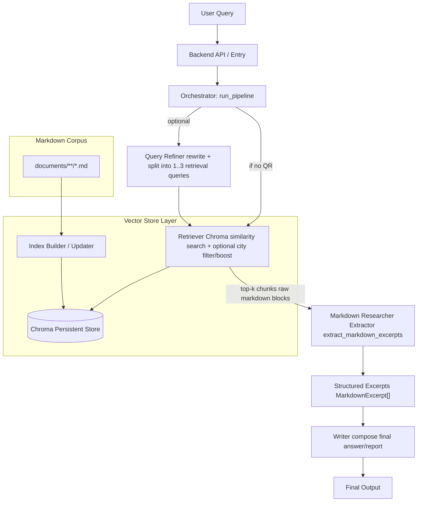

```mermaid
flowchart TD
  U[User Query] --> API[Backend API / Entry]
  API --> ORCH[Orchestrator: run_pipeline]

  ORCH -->|optional| QR[Query Refiner rewrite + split into 1..3 retrieval queries]
  QR --> RET[Retriever Chroma similarity search + optional city filter/boost]
  ORCH -->|if no QR| RET

  RET -->|top-k chunks raw markdown blocks| MR[Markdown Researcher Extractor extract_markdown_excerpts]
  MR --> EX["Structured Excerpts MarkdownExcerpt[]"]

  EX --> WR[Writer compose final answer/report]
  WR --> OUT[Final Output]

  subgraph VS[Vector Store Layer]
    IDX[Index Builder / Updater]
    CH[(Chroma Persistent Store)]
    IDX --> CH
    RET --> CH
  end

  subgraph DOCS[Markdown Corpus]
    MD[documents/**/*.md]
  end

  MD --> IDX
```
