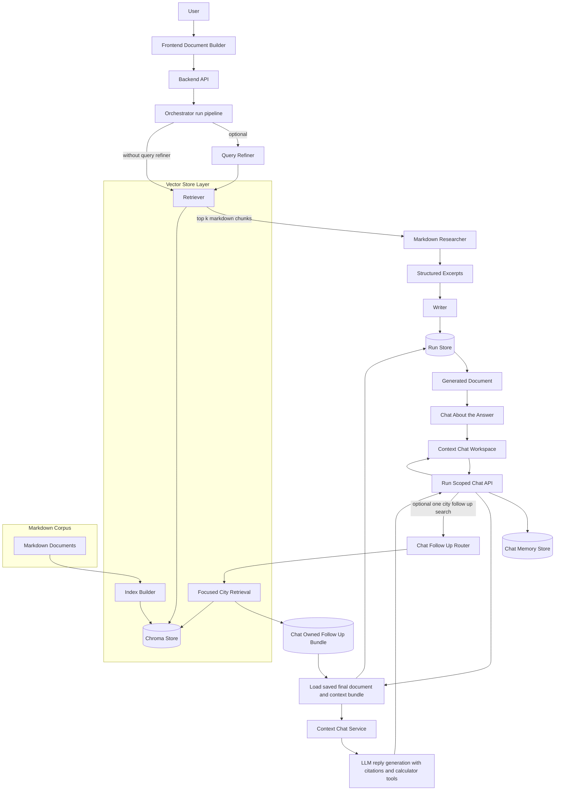

Notes:

- The product remains document-first: chat starts only after a completed run has produced a saved final document and context bundle.
- Context chat is run-scoped. It reuses persisted run artifacts, stores conversation state separately in chat memory, and can combine multiple completed run contexts in one session.
- When the chat router needs narrower evidence, it can trigger a focused one-city follow-up retrieval and attach that result back into the active chat session as a chat-owned follow-up bundle.
- When a chat turn is predicted to require overflow map-reduce, the API now persists the user message, queues a split-mode chat job, and the frontend polls job status until the final assistant message is appended to chat memory.
